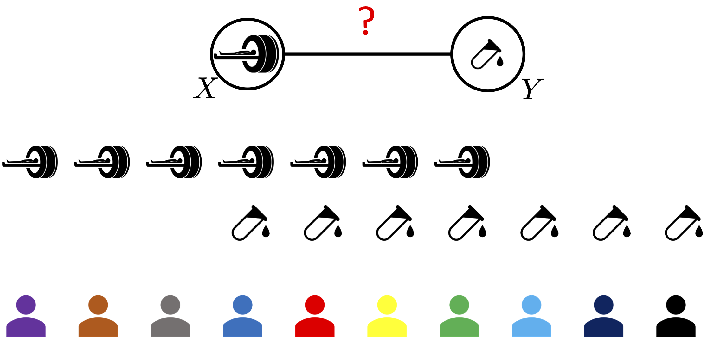

# Semi-paired Association Test (SAT)

This repository contains Matlab code to reproduce the experiments in our submission "Semi-paired Association Testing".
<p align="center">
  
</p>

# Main routines
SAT-rx: semi-paired test in the random X setting. The inputs are kernel matrices for X, Y, and Z (covariates), the outputs are the p-values and test statistics.

``` function [p_val0, p_val, p_valSemi, Sta, StaSemi] = HSIC_Test(Kx, Ky, Kzx, Kzy, pars)```

SAT-fx: semi-paired test in the fixed X setting. The inputs are kernel matrices for X, Y, and Z (covariates), the outputs are the p-values and test statistics.

``` function [p_val0, p_val, p_valSemi, Sta, StaSemi] = LMM_ScoreTest(Kx, Ky, Kzx, Kzy, pars)```

# Simulation Experiments
## Evaluation of type I error and test power of SAT-rx in the simulation setting (1).
```
Simulation (1), SAT-rx
├── run_jobs_simul_typeI_par.sh - script to evaluate type I error of SAT-rx.
├── run_jobs_simul_typeII_par.sh - Script to evaluate test power of SAT-rx.
```
## Evaluation of type I error and test power of SAT-fx in the simulation setting (1).
```
Simulation (1), SAT-rx
├── run_jobs_simul_lmm_typeI_par.sh - script to evaluate type I error of SAT-rx.
├── run_jobs_simul_lmm_typeII_par.sh - Script to evaluate test power of SAT-rx.
```

## Evaluation of type I error and test power of SAT-fx the simulation setting (2). The information about the COPD data can be found in [COPDGene] (http://www.copdgene.org/).
Simulation (2), SAT-fx
├── run_jobs_copd_simul_typeI_par.sh - script to evaluate type I error of SAT-fx.
├── run_jobs_copd_simul_typeII_par.sh - Script to evaluate test power of SAT-fx.
```

# Real Experiments
## P-values on Uganda dataset
- function [p_val0All,p_val0,p_val,p_valSemi,Sta,StaSemi,nl,nlSelUp] = exp_exploration_mimic(dataset,pars) 
- function [p_val0,p_val,p_valSemi,Sta,StaSemi,nl,nlSelUp] = exp_exploration_real(dataset,pars)

## P-values on real imaging
- function exp_copd_geneExpTseng_func(pheno_id, gene_id)

## P-values on biomarker data
- function exp_copd_kl_biomarker_func(fev1_cov)

## P-values on gene expression data
- function exp_copd_kl_geneExp_func(fev1_cov)

# Dependencies 
Our code depends on [KCI-test](http://people.tuebingen.mpg.de/kzhang/KCI-test.zip) and [MEGHA-v1](https://scholar.harvard.edu/tge/software/megha).

